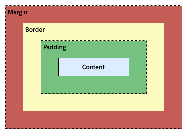

# The Boys

> Helpful links
<br> [MDN documentations](https://developer.mozilla.org/en-US/)
<br> [Google Fonts](fonts.google.com)

## **12/23/21 HTML BASICS** 

+ HTML = content/structure
+ CSS = Style
+ JS = Behavior/Interaction

```html
<p class = 'nice'> Hello World! </p>`
```

### **Heading Elements (tags)**

+ h1 through h6
  + choose tag based on importance and symantic reasoning
+ h1 is supposed to be most important content
  + typically used once

#### **other text elements**

```html
<p> paragraphs </p>
<span> Short text </span>
```

### **Container for elements**

```html
<div> general/common case </div>
<section> groups similar content </section>
<article> </article>
<aside> for side bars / ads </aside>
<header> beginning </header>
<footer> ending </footer>
```

### **Listing elements**
```html
<ul> unordered list where order does not matter</ul>
<ol> ordered list</ol>
<li> list items </li>
```
### **Anchor tags**
```html
<a> </a>
<a href= "#">  - use **href** for hyperlinks
```

### **Navigational Content**

```html
<nav> </nav> - usually inside of a header tag
```

___
## **CSS**
+ written in a separate file

    +   Add this inside of the `<head></head>`  tag to link css to html
        ```html
        <link rel="stylesheet" href="css/style.css">
        ```

rules can be parsed with selectors that are made of properties and values


> **CSS is read top to bottom**
<br> What comes below can override what came above

```css
p{
    color: blue;
}

p{
    color: red;
}
```

### CSS Colors

* Word
* Hex
* RGBa
* HSLa

```css
h1{color:red;}
h2{color:#FF00000;}
h3{color:rgba(255,0,0,1);}
h4{color:hsla(0,100%,50%,1);}
```

### CSS Font-family

```css
span{
    font-weight:700;
}
```

### CSS Relationship selectors

```html
<section>
    <p> </p>
</section>
```
#### relationships
```css
/*direct Parent -> child*/
section > p { /* '>' = only go one level deep || direct child/level deep */
    color: purple;
}

/* parent child*/
section p { /* all level deep */
    color:red;
}

/* sibling
* to select elements that is the next sibling  (Same level)
* only affects the NEXT sibling  
*/
p + p {
    color:blue;
}
```

### **Classes and IDs**

#### IDs are used for selecting distinct elements

`only one id with the same value per document` 
> `#id`

#### Classes are for selecting multiple elements 

`multiple with same value allowed per document`
> `.className`

```css
#id {
    color:blue;
}

.className{
    color:red;
}

p.className1.className2 { 
    /* no spaces between classes means only affects target <p></p> with all classes named */
    color:orange;    
}
```
---
# The Box Model



Margin - is area outside of element, **never** has color **always** transparent

Border - extends around the element, outer edge of any padding. Can be several colors, types, widths.

Padding - exists around the content and inherits background color of content element


## **margin**
margin - sets margin as a single property (top, right, bottom, left) *to the outside of an element
```css
margin: 15px; /* one value sizes all the margins */
margin: 15px 15px; /* two values sizes top/bottom and right/left */
margin: 15px 15px 15px; /* 3 values sizes top, left/right, and bottom margin */
margin: 15px 15px 15px 15px; /* 4 values sizes top, right, bottom, left */
```

## **border**
similar to margin, you can set border-(top,right,bottom,left)

```css
border: <border-width> <border-style> <border-color>; /* Can also be set individually*/
border-style: dotted;
border-width: 10px
border-color: black;
border-top: 2px solid red;
border-right: none; 
border-bottom: 1px dashed aqua;
border-left: 5px dashed #000;

```

> border-styles
>> solid | none | dashed | dotted | double | groove | ridge 
>>
>> hidden - `draws border but does not display` | 
>>
>> inset - `adds a slight bevel to make the element slightly depressed` | 
>>
>> outset - `add a slight bevel to make the element raised`

 #### **`outline` act like borders except they do not take up any space**

## **padding**
similar to using margin, but **padding** adds space inside the element

## **position**

> `relative` positioning is relative to the `HTML` flow; like checkers on a board the css boxes are arranged left to right, and when it gets to the edge you go to the next row.

> `absolute` positioning allows setting the exact positioning of `HTML` content on a page, relative to the parent element. 
>
> *to counter overlap use `z-index` to determine which element goes on top and bottom*

> `fixed` positioning is relative to the browser window

> `static` positioning is placed as it appears in the normal `HTML` flow; **this is  default**

> `sticky` positioning causes the element to toggel between `relative` and `fixed` depending on the scroll position. It is `relative` until a scrolling offset is reached then it is `fixed`

```css
/* elements with block value are automatically placed on new row */
display: block; 
/* elements with inline value are placed on the same row, immediately next to the element preceding them. */
display: inline;
/* elements with inline-block value are placed on the same row as other inline elements, but they can have width and height associated with them, whereas inline cannot */
display: inline-block;


/* 
* Specify positioning after type of positioning 
* applys to all types except static 
*/
left:
right:
top:
bottom:
```
